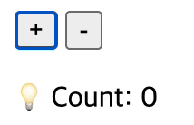

## 소개
### 목적
블로그 포스팅 ([옵저버 패턴으로 컴포넌트 상태 변화 감지하기](https://devhanyoung.tistory.com/10))을 위해 작성된 코드입니다.  

### 구현 사항
   
 

숫자를 카운팅하는 기능을 담은 간단한 페이지를 구현했습니다.    
동일한 기능의 페이지를 두 가지 형태로 구현했습니다.    
beforeRefactoring에는 옵저버 패턴 적용 이전의 코드를 담았습니다.   
afterRefactoring은 옵저버 패턴이 적용된 코드를 담았습니다.     
     
발전을 위한 피드백은 언제나 환영입니다 🙌   

### 실행 방법
각 디렉토리 내의 index.html을 [Live Server](https://marketplace.visualstudio.com/items?itemName=ritwickdey.LiveServer)를 이용해 실행합니다.
